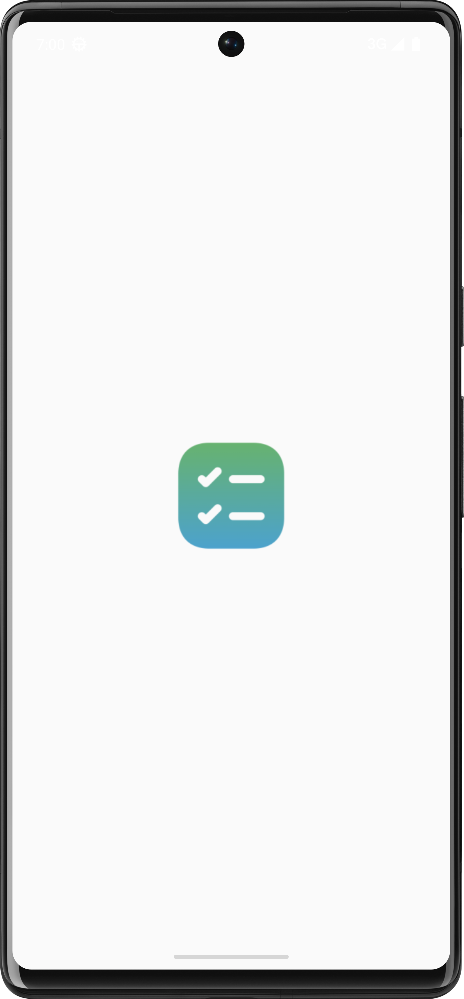
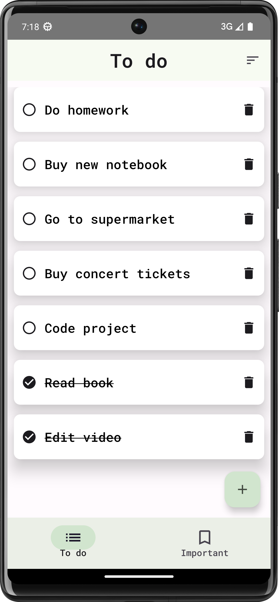
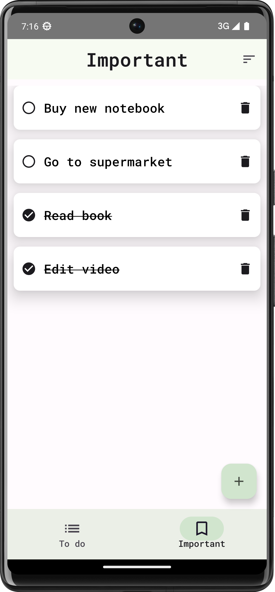
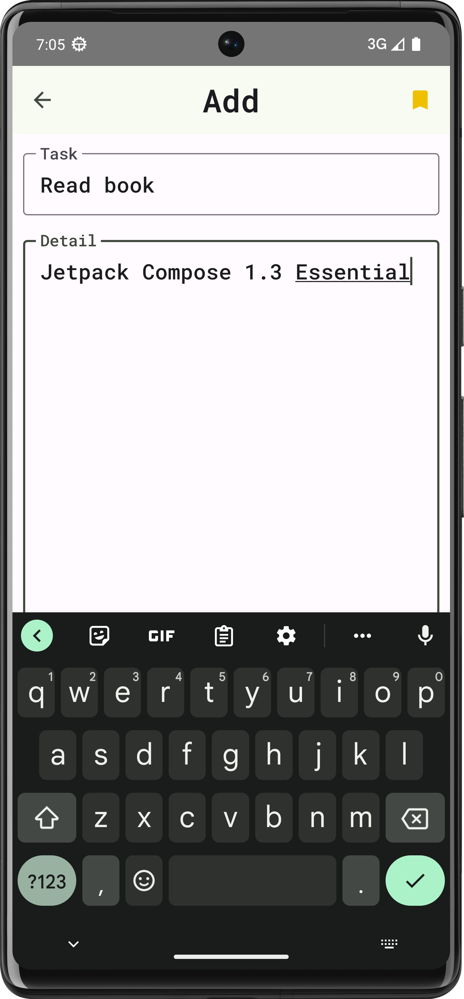

# To-do-app - Android-App
## UI

## Features
* Save the tasks that need to be completed.
* Check whether the work has been completed or not.
* Show important tasks in a separate section.
## Technologies used
* **Kotlin:** Programming language.
* **Jetpack Compose:** Build the UI.
* **Coroutine:** For asynchronous programming.
* **MVVM:** Architectural pattent.
* **Room Database:** Local data storage.